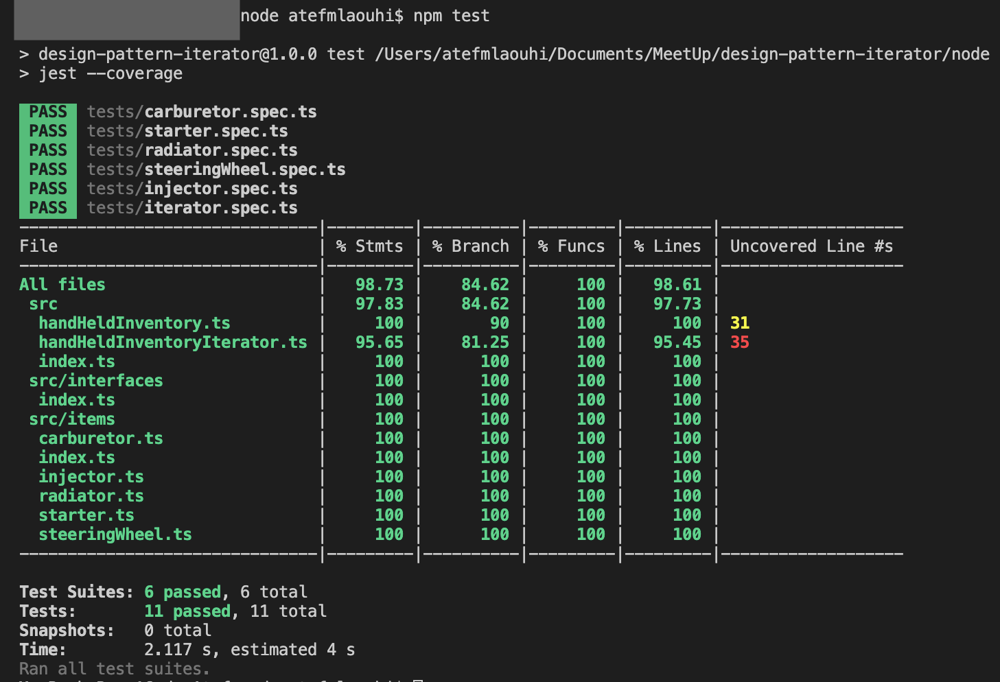
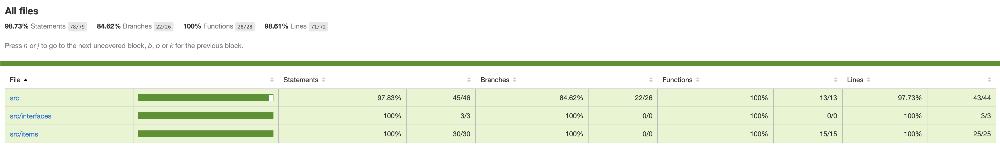
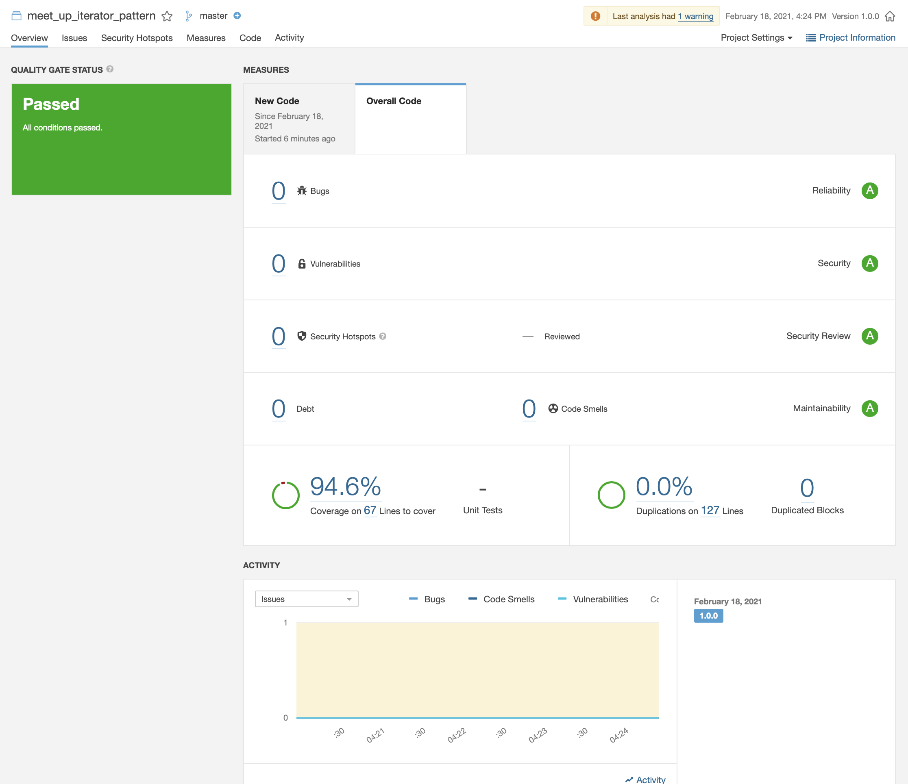

# Design Pattern Iterator with NodeJs

## Tools

- [Visual studio code](https://code.visualstudio.com)
- [Node v12.18.4](https://nodejs.org/en/)
- [TypeScript](https://www.typescriptlang.org)
- [Jest](https://jestjs.io/en/)

## Feature

...

## Implementation

...

## Test

- run command: npm test

## Coverage

- run command: npm test

## Sonar

- run command: npm run sonar

